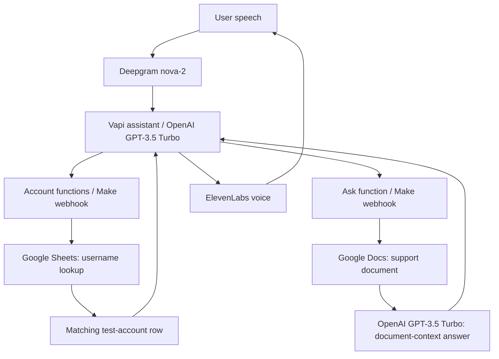

# Valentina — OTT AI Voice Assistant

A voice-agent prototype that connects streaming-service customer support with test-account context. Valentina uses Vapi function calls to retrieve account information and answer questions from an OTT support document through two Make scenarios.

**Built in 2024.**

## Demo video

[Watch the Valentina voice-agent demo](https://chinmaybitne.github.io/videos/ott-voice-agent-demo.mp4) · [Portfolio case study](https://chinmaybitne.github.io/projects/ott-voice-agent/) · [Video file in this repository](media/ott-voice-agent-demo.mp4)

The 4:46 recording demonstrates the original interaction. The published copy hides the test-account table and resource identifiers, and mutes the spoken test-password segment (00:26–00:34).

## What the demo shows

- A conversational test-account verification flow followed by a personalized greeting.
- Subscription-plan lookup and questions about plan pricing and ad-free options.
- Retrieval of watch history, favorite genres, and account contact details.
- FAQ answers about parental controls, third-party cancellation, and connection troubleshooting.

The recorded demonstration runs for approximately 4 minutes 46 seconds. Wishlist lookup is configured but is not demonstrated in the transcribed call. No recommendation-ranking system is shown.

## Architecture

The FAQ workflow passes the document text into the completion prompt. It does not implement embeddings, a vector database, chunk retrieval, or citation verification. The prompt asks the model to answer only from the supplied document; adherence is not independently enforced or evaluated.

## Included configuration

| File | Purpose |
| --- | --- |
| `config/vapi-assistant.sanitized.json` | Assistant export with nine function definitions |
| `scenarios/account.sanitized.blueprint.json` | Make webhook → Google Sheets username query → webhook response |
| `scenarios/faq.sanitized.blueprint.json` | Make webhook → Google Docs → OpenAI completion → webhook response |
| `docs/demo-walkthrough.md` | Timestamped summary of the recorded demonstration |
| `docs/setup-and-limitations.md` | Configuration notes, sanitization details, and prototype limitations |

The account functions are `Password`, `Name`, `Subscription_Plan`, `Watch_History`, `Wishlist`, `Phone_Number`, `Email_Id`, and `Favorite_Genres`. `Ask` routes FAQ questions to the document workflow. The account scenario returns the whole row for each lookup; it does not select a field using `Column_Name`.

## Status and verification

This is a documented prototype with sanitized configuration. The supplied video demonstrates a successful conversation. The exports have been inspected and parsed locally, but have not been re-imported into Vapi or Make, and no current live integration has been tested.

All original webhook endpoints, Google document/spreadsheet identifiers, connection references, and the voice identifier have been replaced or removed. A sanitized demo video is included; the original recording and account sheet are excluded because they display account data and a test password.

Read [setup and limitations](docs/setup-and-limitations.md) before experimenting with these examples. They are disconnected configuration references, not a production authentication template.
